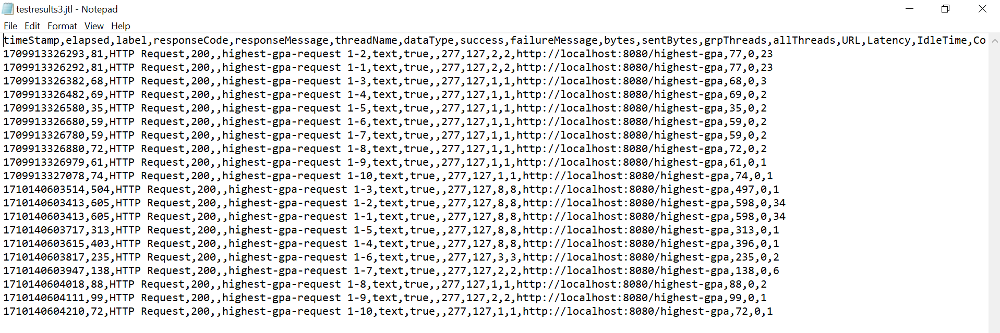

Hasil Jmeter GUI sebelum profiling

Hasil JMeter CLI

Hasil JMeter setelah profiling

Jika dibandingkan perbedaan antara hasil Jmeter sebelum dan sesudah profiling, kecepatan eksekusi request kedua implementasi sangatlah berbeda. Hal ini sangat terlihat untuk implementasi getAllStudentCourses yang awalnya 150000-an menjadi 7000-an ms.
Hal serupa juga terlihat dari hasil refactoring joinStudentName yang berpengaruh terhadap pengolahan request pada endpoint /all-student-name dimana waktu yang diperlukan untuk memproses requestnya menjadi 1/10 kalinya pada saat pengujian dan refactoring pada findStudentWithHighestGPA juga mempercepat pemrosesan request ke endpoint /highest-gpa.
Kesimpulan yang bisa ditarik adalah optimasi yang dilakukan terhadap bagian dalam aplikasi, misal programnya, akan berpengaruh juga terhadap pengujian aplikasi secara blackbox dengan memanfaatkan jmeter.

## Reflection 5
1. Pendekatan pengujian yang memanfaatkan jmeter tidak sepenuhnya peduli mengenai cara program/aplikasinya bekerja, sehingga sering disebut seperti blackbox. Hal ini dikarenakan JMeter hanya perlu melakukan request ke end point yang diberikan dengan jumlah sesuai permintaan penguji. JMeter hanya melihat apakah request tersebut berjalan dengan baik dan mengembalikan response atau tidak.
Sedangkan untuk pendekatan profiling akan benar-benar meneliti alur kerja program saat ada suatu request. Dengan profiling kita bisa mengetahui bagian program mana yang memakan waktu lebih lama dibandingkan dengan program lain sehingga kita bisa dengan lebih baik mengoptimasi bagian-bagian kode kita.
2. Profiling membantu saya dalam mengetahui bagian program mana yang menghambat kinerja aplikasi secara keseluruhan. Dengan demikian, saya hanya perlu mengoptimasi bagian tersebut sehingga aplikasi secara keseluruhan akan meningkat kinerjanya dengan lebih baik tanpa perlu memperbaiki terlalu banyak bagian dari aplikasinya.
3. Ya, seperti pada contoh latihan dalam tutorial, dengan adanya Intellij profiler, saya jadi bisa mengetahui kalau bagian program yang memakan waktu paling lama misal adalah bagian method findStudentWithHighestGpa. Bahkan saya bisa mengetahui baris mana pada method tersebut yang menghambat kinerja methodnya. Karena saya mendapatkan informasi durasi waktu yang diperlukan untuk mengoperasikan pemanggilan-pemanggilan fungsinya, saya bisa dengan lebih mudah mendeteksi bagian program mana yang menjadi bottler neck terhadap program yang lebih besarnya.
4. Tantangan utama yang dihadapi dalam melakukan pengujian performansi dan profiling adalah membaca hasil output apa yang penting untuk saya pahami dan mengetahui bagian program mana yang menjadi bottleneck dari aplikasi. Hal ini bisa ditanggulangi dengan cara membaca hasil output baik dari JMeter maupun profiler dengan lebih hati-hati dan pelan-pelan dan mungkin memang perlu pembiasaan terhadap teknologi baru ini sehingga bisa mendapatkan informasi esensial darinya dengan lebih mudah.
5. Seperti yang sudah dijelaskan sebelumnya, dengan adanya profiler dari Intellij saya bisa mendeteksi bagian program yang menjadi bottleneck, berapa lama durasi yang diperlukan untuk mengeksekusi suatu method call, dan seberapa sering dipanggilnya suatu method sehingga kita bisa menyesuaikan bagian program mana yang memang perlu dioptimasi dan bagian mana yang tidak perlu. Perlu diingat kalau "premature optimization is the root of all evil" karena optimasi-optimasi yang tidak diperlukan hanya akan menurunkan readability dari kode kita.
6. Sejauh ini saya belum menemukan kasus seperti yang dibicarakan, namun dari yang saya baca, performa JMeter dipengaruhi oleh berbagai aspek misal os, versi jvm, dan sebagainya. Hal ini bisa membuat perbedaan dalam pengujian JMeter satu perangkat ke perangkat lain. Cara mengatasinya dari yang saya dapatkan dari tautan berikut https://stackoverflow.com/questions/68666822/jmeter-results-not-consistent-and-depend-from-the-running-machine adalah dengan memanfaatkan container seperti docker dibandingkan .jmx dan juga menggunakan think time. Dengan demikian, harapannya hasil pengujian JMeternya sendiri bisa menjadi lebih konsisten dan tidak berubah ubah dari 1 mesin ke mesin lain.

    Selain itu, hasil pengujian dari profiler dan JMeter juga memang kemungkinan menghasilkan hasil yang berbeda karena cara kerjanya yang berbeda dimana JMeter berguna untuk stress testing suatu aplikasi sedangkan Profiler hanya digunakan untuk melihat seberapa sering cuplikan kode digunakan dalam suatu proses.
7. Strategi yang saya lakukan untuk mengoptimasi kode setelah dilakukan testing dan profiling adalah melihat durasi yang diperlukan program untuk memenuhi request dengan jmeter. Jika waktunya terlalu lama maka perlu diperiksa dengan profiler dan melihat bagian kode mana yang menjadi bottleneck dan setelah itu mencari cara untuk mempercepat bagian kode tersebut. Cara untuk memastikan kebenaran kodenya setelah perubahan tersebut adalah dengan memastikan outputnya sama dengan yang sebelumnya. Cara yang lebih baik adalah dengan membangun unit test seperti yang dibahas pada tutorial sebelumnya dan menjalankan unit test tersebut, jika lulus maka seharusnya kode hasil refactoring berjalan dengan benar, tetapi itu kembali lagi apakah unit test yang dibuat benar dan berguna.
